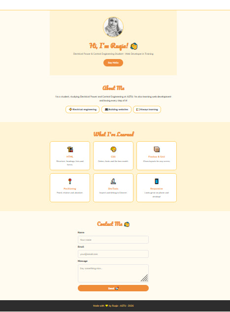

# 🌟 Simple beginner friendly Portfolio

Welcome to my personal developer portfolio! This project serves as a showcase of my journey as an **Electrical Power & Control Engineering student** and an aspiring **Web Developer**.

## 🛠️ Tech Stack
This project was built using core web technologies:
* **HTML5:** Semantic structure and form handling.
* **CSS3:** Modern styling including:
    * **Flexbox** for navigation and layout alignment.
    * **CSS Grid** for the responsive "What I've Learned" card layout.
    * **Media Queries** to ensure a seamless experience on mobile, tablet, and desktop.
    * **Google Fonts** for custom typography.

## 💡 Key Features
* **Responsive Design:** The layout automatically adjusts from a 3-column grid on desktop to a single column on mobile devices.
* **Interactive Elements:** Features hover effects on cards and buttons for better user engagement.
* **Functional Contact Form:** A clean, accessible form layout styled to match the site's aesthetic.
* **Modern Aesthetic:** A vibrant, friendly color palette designed to reflect a welcoming personal brand.

## 📸 Project Preview


## 📁 Project Structure
```text
├── css/
│   └── style.css
├── image/
│   ├── profile.png
│   └── projectOverview.jpg
├── index.html
└── README.md
